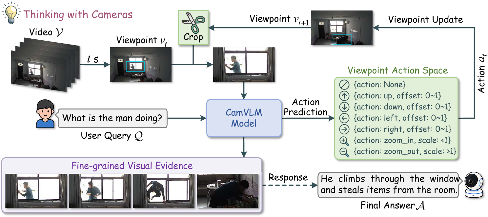

<div align="center">

# Thinking with Cameras: Active Visual Reasoning via Dynamic Viewpoint Control for Surveillance Video Understanding

<a href="https://scholar.google.com/citations?user=yYi80ToAAAAJ&hl=en">Xiao Zhang</a><sup>1,2</sup>&emsp;
<a href="https://scholar.google.com/citations?user=u_RNsOUAAAAJ&hl=en">Wang Zeng</a><sup>2</sup>&emsp;
<a href="https://scholar.google.com/citations?user=wrNd--oAAAAJ&hl=en">Sheng Jin</a><sup>2</sup>&emsp;
<a href="https://scholar.google.com/citations?user=KZn9NWEAAAAJ&hl=en">Wentao Liu</a><sup>2</sup>&emsp;
<a href="https://scholar.google.com/citations?user=AerkT0YAAAAJ&hl=en">Chen Qian</a><sup>2</sup>&emsp;
<a href="https://scholar.google.com/citations?user=iFp1FOMAAAAJ&hl=en">Shichao Kan</a><sup>1</sup>

<sup>1</sup>Central South University&emsp;
<sup>2</sup>SenseTime Research and Tetras.AI

</div>

### Overview
**CamVLM** is a vision-language framework that actively controls the viewpoints of real-world cameras to acquire task-relevant visual evidence in surveillance scenarios.

Training LVLMs to control real-world cameras is constrained by the lack of large-scale viewpoint-action trajectories collected from interactions between target objects and physical surveillance cameras. To address this, we introduce a virtual camera simulation scheme. Specifically, we treat the full video frame as a panoramic observation space and a local region within the frame as the current camera viewpoint. Within this space, CamVLM adjusts the viewpoint through parameterized translation and zoom operations according to the position and scale of the target object in the field of view. Based on this formulation, CamVLM learns the camera control policy through SFT and RL. For deployment on real-world surveillance cameras, the predicted actions and parameters can be converted into executable camera control commands according to the camera hardware specifications, such as the horizontal/vertical rotation range, angular resolution, field of view, and optical zoom or focal-length range.



<a href="https://arxiv.org/abs/2609.06475"></a> <a href="https://huggingface.co/collections/xiaozhang79/camvlm"></a>

## 🚀 News

**[2026/09]** Code, the CamVLM model, and the CCTV-Anomaly and CamTrack-53K datasets have been open-sourced.

**[2026/09]** CamVLM paper is released.

## 🛠️ Installation

### Clone the repository

```bash
git clone https://github.com/xiaozhang79/CamVLM
cd CamVLM
```

### Install dependencies

```bash
conda create -n camvlm python=3.10 -y
conda activate camvlm
pip install --upgrade pip
pip install --no-build-isolation -r requirements.txt
```

## 📂 Dataset Preparation

### CCTV-Anomaly

We release [CCTV-Anomaly](https://huggingface.co/collections/xiaozhang79/camvlm), a high-quality training dataset for surveillance anomaly understanding. Download it and place the extracted files under `datasets/cctv_anomaly/`:

```text
datasets/cctv_anomaly/
├── train.jsonl
├── test.jsonl
└── videos/
```

#### Terms of Use

1. CCTV-Anomaly dataset is ONLY for research and non-commercial use. The annotations of CCTV-Anomaly dataset belong to [SenseTime Research](https://www.sensetime.com/), and are licensed under a [Creative Commons Attribution-NonCommercial 4.0 License](https://creativecommons.org/licenses/by-nc/4.0/legalcode).

2. For commercial usage of our CCTV-Anomaly annotations, please contact Mr. Malon (machang[at]tetras[dot]ai) and cc Sheng Jin (jinsheng13[at]foxmail[dot]com).

### CamTrack-53K

We release [CamTrack-53K](https://huggingface.co/collections/xiaozhang79/camvlm), a high-quality training dataset for camera viewpoint control. We provide the annotation data, and the corresponding video files are sourced from:

- [MeViS](https://codalab.lisn.upsaclay.fr/competitions/15094)
- [A2D](https://web.eecs.umich.edu/~jjcorso/r/a2d/index.html#downloads)
- [YouTube-VOS](https://competitions.codalab.org/competitions/29139#participate-get_data)

Place the files under `datasets/camtrack_53k/`:

```text
datasets/camtrack_53k/
├── train_sft.json
├── train_rl.json
├── MeViS/
├── A2D-Sentences/
└── Refer-YouTube-VOS/
```

### UDVideoQA*

We use the large-scale urban traffic surveillance video question answering dataset [UDVideoQA](https://huggingface.co/datasets/UDVideoQA/Urban_Dynamics_VideoQA_dataset) as one of our evaluation benchmarks, which covers urban intersection scenarios under diverse traffic, weather, and illumination conditions. Since the original test split is no longer available, we construct UDVideoQA* with permission from the original authors using Set 03 and Set 20 from the released dataset, which provide the greatest question diversity. Please download the `Set_03` and `Set_20` subsets from the official dataset and place them under `datasets/udvideoqa/`:

```text
datasets/udvideoqa/
├── Set_03/
│   ├── 2.26pm_10.1mins_clips_annotations.jsonl
│   └── 2.26pm_10.1mins_clips/
└── Set_20/
    ├── 2.37pm_10.1pm_clips_60_annotations.jsonl
    └── 2.37pm_10.1pm_clips_60/
```

## 🏋️ Training

We provide the trained [CamVLM-8B](https://huggingface.co/collections/xiaozhang79/camvlm) model for direct evaluation. Alternatively, to train CamVLM from scratch, place the base model (e.g., Qwen3-VL-8B-Instruct) under `ckpts/Qwen3-VL-8B-Instruct/` and follow the SFT and RL training steps.

### SFT

Jointly train on CCTV-Anomaly and CamTrack-53K. The model is saved under `ckpts/CamVLM-SFT/`:

```bash
bash scripts/train/sft/run_sft.sh
```

### RL

Start from `ckpts/CamVLM-SFT/` using the CamTrack-53K RL annotations. The model is saved under `ckpts/CamVLM-RL/`:

```bash
bash scripts/train/rl/run_rl_vllm.sh
```

## 📊 Evaluation

For benchmark evaluation, we use an LLM-as-a-judge protocol to score model predictions on both CCTV-Anomaly and UDVideoQA*. Before evaluation, please set `OPENAI_API_KEY`; other compatible LLM API endpoints can also be configured if needed. For deployment on real-world surveillance cameras, the predicted actions and parameters can be converted into executable camera control commands according to the hardware specifications, such as the horizontal/vertical rotation range, angular resolution, field of view, and optical zoom or focal-length range.

### CCTV-Anomaly

CCTV-Anomaly has three evaluation settings:

#### Conventional full-frame passive viewpoint

```bash
bash scripts/eval/cctv_anomaly/eval_full.sh
```

#### Center 1/9 passive viewpoint (simulating a local camera-view region within the panoramic observation space)

```bash
bash scripts/eval/cctv_anomaly/eval_passive.sh
```

#### Dynamic viewpoint (simulating a local camera-view region within the panoramic observation space)

```bash
bash scripts/eval/cctv_anomaly/eval_dynamic.sh
```

### UDVideoQA*

UDVideoQA* has two evaluation settings:

#### Center 1/9 passive viewpoint (simulating a local camera-view region within the panoramic observation space)

```bash
bash scripts/eval/udvideoqa/eval_passive.sh
```

#### Dynamic viewpoint (simulating a local camera-view region within the panoramic observation space)

```bash
bash scripts/eval/udvideoqa/eval_dynamic.sh
```

## 💬 Contact

If you have any questions about the paper, codebase, or experimental setup, please feel free to contact [xiaozhang0479@gmail.com](mailto:xiaozhang0479@gmail.com).

## 📢 Citation

If you find our paper, code, model, and datasets helpful for your research and applications, please consider giving a star ⭐ and citing our paper:

```bibtex
@article{zhang2026thinking,
  title={Thinking with Cameras: Active Visual Reasoning via Dynamic Viewpoint Control for Surveillance Video Understanding},
  author={Zhang, Xiao and Zeng, Wang and Jin, Sheng and Liu, Wentao and Qian, Chen and Kan, Shichao},
  journal={arXiv preprint arXiv:2609.06475},
  year={2026}
}
```
